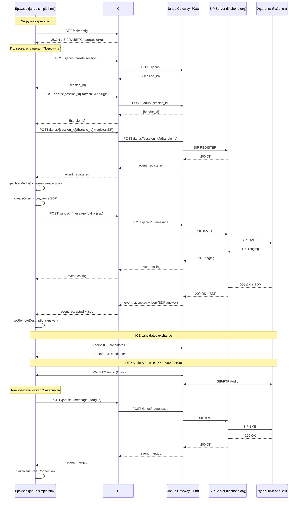

# SIP WebRTC Project with Janus Gateway

## Структура проекта

```
C:\попытка sip\
├── docker-compose.yml          # Docker конфигурация для Janus Gateway
├── janus-config/               # Конфигурация Janus Gateway
└── csharp-server/              # C# ASP.NET Core прокси сервер
    └── JanusProxy/
        ├── Program.cs          # Основной файл сервера
        └── wwwroot/            # Статические файлы (HTML клиенты)
            ├── index.html      # Главная страница с JsSIP
            ├── janus-simple.html  # Простой Janus SIP клиент
            └── adapter.js      # WebRTC адаптер
```

## Запуск

1. Запустите Janus Gateway в Docker:
   ```bash
   docker-compose up -d
   ```

2. Запустите C# прокси сервер:
   ```bash
   cd csharp-server/JanusProxy
   dotnet run
   ```

3. Откройте в браузере:
   - http://localhost:8081 - главная страница
   - http://localhost:8081/janus-simple.html - простой Janus клиент

## Порты

- 8081 - C# прокси сервер (HTTP + статические файлы)
- 8088 - Janus Gateway (HTTP API)
- 20000-20100/udp - RTP медиа потоки

## Технологии

**Backend:**
- **Janus Gateway** - WebRTC медиа сервер с SIP плагином (Docker)
- **C# ASP.NET Core 9.0** - прокси сервер с конфигурационным API
  - CORS настройки для dev/prod
  - `/janus` прокси эндпоинт для Janus Gateway API
  - `/api/config` эндпоинт для клиентской конфигурации
  - Конфигурационные файлы по окружениям (appsettings.json)

**Frontend:**
- **Vanilla JavaScript** - нативный WebRTC API браузера
- **Janus JavaScript API** - long polling для событий, JSON API для Janus

**Протоколы:**
- WebRTC (ICE, SDP, RTP/RTCP)
- SIP (регистрация, INVITE, BYE через Janus SIP плагин)
- STUN для NAT traversal
- Opus аудио кодек

## Архитектура и flow


